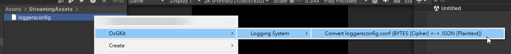

<p align="center">
  
</p>

[](https://github.com/michael811125/OxGKit/blob/master/LICENSE.md)

---

## 基本介紹

OxGKit 是基於 Unity 設計於遊戲開發常用的系統工具組 (皆為獨立工具)。

**TODO 未來會補充 OxGKit 的文檔**

[Coding Style wiki](https://github.com/michael811125/OxGFrame/wiki/Coding-Style)

**目前包含以下**

- [無限列表 (Infinite ScrollView)](https://github.com/michael811125/OxGKit#infinitescrollview-dependence-unitask-oxgkitloggingsystem)
- [動作序列系統 (Action System)](https://github.com/michael811125/OxGKit#actionsystem-dependence-unitask-oxgkitloggingsystem)
- [通知系統 (Notice System)](https://github.com/michael811125/OxGKit#noticesystem-or-reddotsystem-dependence-oxgkitloggingsystem)
- [輸入控制系統 (Input System)](https://github.com/michael811125/OxGKit#inputsystem-dependence-unity-new-inputsystem-oxgkitloggingsystem)
- [日誌系統 (Logging System)](https://github.com/michael811125/OxGKit#loggingsystem-dependence-lwmybox)
- [DoTween Pro 的補間動畫系統 (TweenSystem)](https://github.com/michael811125/OxGKit#tweensystem-dependence-dotween-pro-lwmybox-oxgkitutilities)
- [按鈕系統 (Button System)](https://github.com/michael811125/OxGKit#buttonsystem)
- [時間系統 (Time System)](https://github.com/michael811125/OxGKit#timesystem)
- [游標系統 (Cursor System)](https://github.com/michael811125/OxGKit#cursorsystem)
- [物件池系統 (Pool System)](https://github.com/michael811125/OxGKit#poolsystem)
- [單例系統 (Singleton System)](https://github.com/michael811125/OxGKit#singletonsystem)
- [儲存系統 (Saver System)](https://github.com/michael811125/OxGKit#saversystem)
- [本地化系統 (Localization System)](https://github.com/michael811125/OxGKit#localizationsystem)
- [虛擬搖桿系統 (Virtual Joystick)](https://github.com/michael811125/OxGKit#virtualjoystick)
- [各通用必備組件工具 (Utilities)](https://github.com/michael811125/OxGKit#utilities-dependence-unitask)

*[會持續擴充工具系統組]*


---

## 工具系統介紹

## InfiniteScrollView (dependence UniTask, OxGKit.LoggingSystem)

無限列表 (魔改版)，基於原生 UGUI 能夠簡單的繼承或使用現有的 Infinite ScrollView，以物件池的概念進行物件有效循環利用。

Reference: [howtungtung - InfiniteScrollView](https://github.com/howtungtung/InfiniteScrollView)

*[參考 Example]*

### Installation

| Install via git URL |
|:-|
| Add https://github.com/michael811125/OxGKit.git?path=Assets/OxGKit/InfiniteScrollView/Scripts to Package Manager |

**第三方庫 (需自行安裝)**
- 使用 [UnitTask v2.5.0 or higher](https://github.com/Cysharp/UniTask)
- 使用 OxGKit.LoggingSystem, Add https://github.com/michael811125/OxGKit.git?path=Assets/OxGKit/LoggingSystem/Scripts to Package Manager

※備註 : Right-Click Create/OxGKit/Infinite ScrollView... (Template cs)

---

## ActionSystem (dependence UniTask, OxGKit.LoggingSystem)

動作序列系統，能夠自行定義 Action 並且自行組合運行組，預設 Actions 有 SequenceAction, ParallelAction, ParallelDelayAction, DelayAction, DelegateAction，另外如果針對動畫需要進行拼湊處理，也可以使用 ActionSystem 作為運行。
- 透過 Right-Click Create/OxGKit/Action System/Template Action.cs 實作自定義 Action。

*[參考 Example]*

### Installation

| Install via git URL |
|:-|
| Add https://github.com/michael811125/OxGKit.git?path=Assets/OxGKit/ActionSystem/Scripts to Package Manager |

**第三方庫 (需自行安裝)**
- 使用 [UnitTask v2.5.0 or higher](https://github.com/Cysharp/UniTask)
- 使用 OxGKit.LoggingSystem, Add https://github.com/michael811125/OxGKit.git?path=Assets/OxGKit/LoggingSystem/Scripts to Package Manager

**ActionSystem Demo**

https://github.com/michael811125/OxGKit/assets/30960759/169d91ea-3709-420c-8751-f50119e97d35

※備註 : Right-Click Create/OxGKit/Action System... (Template cs)

---

## NoticeSystem or RedDotSystem (dependence OxGKit.LoggingSystem)

通知系統 (也稱紅點系統)，支援動態新增刪除通知條件，可以自行定義通知條件，再針對 NoticeItem 進行條件持有註冊，當 NoticeItem 身上其中持有任一符合條件則通知顯示圖示 (紅點)。
- 透過 Right-Click Create/OxGKit/Notice System/Template Notice Condition.cs 實作通知條件。
- 將 NoticeItem prefab 拖曳至 UI 上，自行指定 ICON，再取得 NoticeItem 身上的組件進行條件註冊 (當 OnDestroy 時，會自動 Deregister)。
- 當有數據狀態變更時，必須通知特定條件 ID 進行 Notify，將會透過條件 ID 進行查找持有的 NoticeItems，並且進行刷新顯示。

*[參考 Example]*

### Installation

| Install via git URL |
|:-|
| Add https://github.com/michael811125/OxGKit.git?path=Assets/OxGKit/NoticeSystem/Scripts to Package Manager |

**第三方庫 (需自行安裝)**
- 使用 OxGKit.LoggingSystem, Add https://github.com/michael811125/OxGKit.git?path=Assets/OxGKit/LoggingSystem/Scripts to Package Manager

**NoticeSystem Demo**

https://github.com/michael811125/OxGKit/assets/30960759/c6966327-3ede-432e-b8fe-bee53f629f25

※備註 : Right-Click Create/OxGKit/Notice System... (Template cs)

---

## InputSystem (dependence Unity New InputSystem, OxGKit.LoggingSystem)

輸入控制系統，支援 Unity New InputSystem，如果使用 Unity New InputSystem 需自行建立 Unity New InpuptSystem 的控制表 (Control Maps)，並且還有提供使用於 Unity New InputSystem 的 Binding Composite 腳本模板，最後再由 Input Action 派送輸入訊號控制由訂閱者訂閱，進而做到遊戲中的控制邏輯不需要知道平台裝置區分，皆由 Input Action 進行整合，當然 Input Action 也支援其他輸入控制插件，作為單純的輸入控制派送者。
- 透過 Right-Click Create/OxGKit/Input System/Template Input Action.cs 實作 InputAction 介面。
- 調用 Inputs API (using.OxGkit.InputSystem)

**主要層級驅動區分為以下**

- For Unity New InputSystem
  - Control Maps (Input Action Asset)
  - Binding Composites
- For Any Inputs
  - Input Actions (此為獨立作為通用訊號派送者，不依賴任何輸入控制插件，皆可自由實現)

*[參考 Example]*

### Installation

| Install via git URL |
|:-|
| Add https://github.com/michael811125/OxGKit.git?path=Assets/OxGKit/InputSystem/Scripts to Package Manager |

**第三方庫 (需自行安裝)**
- 使用 [Unity New InputSystem v1.5.1 or higher](https://docs.unity3d.com/Packages/com.unity.inputsystem@1.5/manual/Installation.html)
- 使用 OxGKit.LoggingSystem, Add https://github.com/michael811125/OxGKit.git?path=Assets/OxGKit/LoggingSystem/Scripts to Package Manager

**InputSystem Demo**

https://github.com/michael811125/OxGKit/assets/30960759/20548ee4-b77b-4cda-8d49-c82b16deddb7

※備註 : Right-Click Create/OxGKit/Input System... (Template cs)

---

## LoggingSystem (dependence LWMyBox)

日誌系統，支持 Cipher & Plaintext (可以任一轉換)，支持動態配置與覆寫原有的日誌器功能，其他還有全域開關、全域級別、個別開關配置、個別級別配置。
- 透過 Right-Click Create/OxGKit/Logging System/Create loggersconfig.conf (In StreamingAssets) 建立配置檔。
  - 
- 透過 LoggingLauncher 進行配置或只直接修改 loggersconfig.conf 文件。

**Build 激活宏**
- OXGKIT_LOGGER_ON

配置文件轉換。



LoggingLauncher 配置介面，可以配置 logActive (開關)、logLevel (級別)。
- 透過 Package Manager -> Samples 匯入 LoggingLauncher Prefab，再拖曳至場景上激活環境配置 (僅需激活一次)，會自動嘗試加載 loggersconfig.conf 進行日誌開關控制。 


新增 Logger 或移除 Logger，皆需呼叫 LoggingLauncher.TryLoadLoggers() 進行重載 (建議定義一個 default constructor，避免搭配 HybridCLR + Activator.CreateInstance(type) 出現錯誤)。
```C#
using OxGKit.LoggingSystem;

[LoggerName("MyLogger")]
public class MyLogger1 : Logging 
{
    // If use HybridCLR must create a default constructor
    public MyLogger1() { }
}

// Use same name to override MyLogger1
[LoggerName("MyLogger", true)]
public class MyLogger2 : Logging 
{
    // If use HybridCLR must create a default constructor
    public MyLogger2() { }
	
    public override void Log(object message)
    {
        UnityEngine.Debug.Log("[Override]" + message);
    }
    
    public override void LogWarning(object message)
    {
        UnityEngine.Debug.LogWarning("[Override]" + message);
    }
    
    public override void LogError(object message)
    {
        UnityEngine.Debug.LogError("[Override]" + message);
    }
    
    public override void LogException(Exception exception)
    {
        UnityEngine.Debug.LogException(exception);
    }
}
```

如果搭配 HybridCLR 有主工程跟熱更工程的區分，必須手動拆分創建 AOT 跟 Hotfix 的 Loggers 初始流程，可以參考以下：
```C#
// HybridCLR (必須取消 LoggingLauncher 上的 "Initialize On Awake" 選項):
LoggingLauncher.CreateLogger<LoggingDemoLogger1>();
LoggingLauncher.CreateLogger<LoggingDemoLogger2>();
LoggingLauncher.CreateLogger<LoggingDemoLogger3>();
LoggingLauncher.CreateLogger<LoggingDemoLogger4>();
LoggingLauncher.TryLoadLoggers();
```

動態配置日誌器，參考如下：
```C#
// Reload LoggersConfig at Runtime (方式一)
var loggersConfig = new LoggersConfig
(
    new LoggerSetting("LoggingDemo.Logger1", true, LogLevel.Log),
    new LoggerSetting("LoggingDemo.Logger2", true, LogLevel.LogWarning),
    new LoggerSetting("LoggingDemo.Logger3", true, LogLevel.Off)
);
LoggingLauncher.SetLoggersConfig(loggersConfig);

// Reload LoggersConfig at Runtime (方式二)
LoggingLauncher.ConfigureLogger("LoggingDemo.Logger1", false);
LoggingLauncher.ConfigureLogger("LoggingDemo.Logger2", true, LogLevel.LogWarning | LogLevel.LogError);
LoggingLauncher.ConfigureLogger("LoggingDemo.Logger3", false);
```

以下是在 AOT 工程中初始 AOT 工程的 Loggers **(如果 Hotfix 工程的 Loggers 需要再 Hotfix 工程中初始)**：


*[參考 Example]*

### Installation

| Install via git URL |
|:-|
| Add https://github.com/michael811125/OxGKit.git?path=Assets/OxGKit/LoggingSystem/Scripts to Package Manager |

**第三方庫 (需自行安裝)**
- 使用 [LWMyBox v1.1.4 or higher](https://github.com/michael811125/LWMyBox), Add https://github.com/michael811125/LWMyBox.git to Package Manager

**LoggingSystem Demo**

https://github.com/michael811125/OxGKit/assets/30960759/51ecddd7-5241-43e9-9104-de45cbc5f68d

**LoggingSystem Build Test**

https://github.com/michael811125/OxGKit/assets/30960759/cef1a484-d617-466d-bf3e-6104032d7c3f

---

## TweenSystem (dependence DoTween Pro, LWMyBox, OxGKit.Utilities)

補間動畫 (僅支持 [DoTween Pro](https://assetstore.unity.com/packages/tools/visual-scripting/dotween-pro-32416))。
- Add Component/OxGKit/TweenSystem/DoTweenAnim
- Add Component/OxGKit/TweenSystem/DoTweenAnimEvent

**Highly Recommended [brunomikoski - Animation Sequencer](https://github.com/brunomikoski/Animation-Sequencer)**

<!---
**注意：建議先安裝 OxGKit.TweenSystemFixer，避免編譯失敗導致 MenuItem 無法顯示與啟用**

- Add https://github.com/michael811125/OxGKit.git?path=Assets/OxGKit/TweenSystemFixer/Scripts to Package Manager
--->

Preview Mode (Only DoTweenAnim component is supported)


※Note: The DoTweenAnimEvent only plays at runtime.

*[參考 Example]*

### Installation

| Install via git URL |
|:-|
| Add https://github.com/michael811125/OxGKit.git?path=Assets/OxGKit/TweenSystem/Scripts to Package Manager |

**第三方庫 (需自行購買安裝)**
- 使用 [DoTween Pro v1.0.335 or higher](https://assetstore.unity.com/packages/tools/visual-scripting/dotween-pro-32416)

**第三方庫 (需自行安裝)**
- 使用 [LWMyBox v1.1.4 or higher](https://github.com/michael811125/LWMyBox), Add https://github.com/michael811125/LWMyBox.git to Package Manager
- 使用 OxGKit.Utilities, Add https://github.com/michael811125/OxGKit.git?path=Assets/OxGKit/Utilities/Scripts to Package Manager

<!--- ### Create DoTween Assemblies (Must use TweenSystemFixer to fix GUID) --->
### Create DoTween Assemblies


**TweenSystem Demo**

https://github.com/michael811125/OxGKit/assets/30960759/6bf690b6-c4d0-40f6-b3c9-b50ab62562e8

<!---
---

### TweenSystemFixer (only for OxGkit.TweenSystem)

用於修復 OxGKit.TweenSystem 查找 DOTween.Modules assembly GUID 失敗問題，主要是因為 DoTween Pro 插件每次生成的 Assembly GUID 都不一樣，所以需要固定設置 OxGKit.TweenSystem 原本引用的 GUID，才能正確引用到 DOTween.Modules 的庫。

**僅用於修復 OxGKit.TweenSystem 已引用 DoTween.Modules 的固定 GUID**

### Installation

| Install via git URL |
|:-|
| Add https://github.com/michael811125/OxGKit.git?path=Assets/OxGKit/TweenSystemFixer/Scripts to Package Manager |

### Reassign DOTween.Modules assembly GUID (Fix Error GUID)

#### 手動修復 Fixed GUID

如果未事先額外安裝 OxGKit.TweenSystemFixer 者，可以直接使用 Notepad++ 開啟 Plugins/Demigiant/DoTween/Modules/DOTween.Modules.asmdef.meta，直接修改 GUID 為以下 Fixed GUID 即可。
- 如果已經有其他 Assembly 引用原有 DoTween.Modules GUID，也要將原有 DoTween.Modules 的 GUID 取代成以下 Fixed GUID。

**Fixed GUID**

```
fdf3e181e62e9d243a7fee5ce890ab71
```

#### 工具修復 Fixed GUID


--->
---

## ButtonSystem

ButtonPlus 是基於繼承 Unity UGUI 的 Button 進行擴展的，功能擴展支持各 Long Click 等行為。

*[參考 Example]*

### Installation

| Install via git URL |
|:-|
| Add https://github.com/michael811125/OxGKit.git?path=Assets/OxGKit/ButtonSystem/Scripts to Package Manager |

**ButtonSystem Demo**

https://github.com/michael811125/OxGKit/assets/30960759/891291af-1bb4-4515-bec6-a9877f4ca254

## TimeSystem

各種 DeltaTimer, RealTimer, DTUpdater, RTUpdater, IntervalTimer, IntervalSetter, NtpTime (clock sync with NTP server) 關於時間的控制器。

*[參考 Example]*

### Installation

| Install via git URL |
|:-|
| Add https://github.com/michael811125/OxGKit.git?path=Assets/OxGKit/TimeSystem/Scripts to Package Manager |

**TimeSystem Demo**

https://github.com/michael811125/OxGKit/assets/30960759/ee085eb4-f803-45e5-9593-b481a4b5a821

## CursorSystem

Cursor 游標管理器，支持靜態與動態游標與各種狀態行為切換 (例如經營模擬類的遊戲，需要有各種游標狀態等...)。

*[參考 Example]*

### Installation

| Install via git URL |
|:-|
| Add https://github.com/michael811125/OxGKit.git?path=Assets/OxGKit/CursorSystem/Scripts to Package Manager |

**CursorSystem Demo**

https://github.com/user-attachments/assets/49e2a081-6d31-4ba6-8bb8-be60a148742c

## PoolSystem

簡易 GameObject 物件池，支持異步分散幀加載 (負載平衡)。

*[參考 Example]*

### Installation

| Install via git URL |
|:-|
| Add https://github.com/michael811125/OxGKit.git?path=Assets/OxGKit/PoolSystem/Scripts to Package Manager |

**PoolSystem Demo**

https://github.com/user-attachments/assets/822d2431-0ee4-487c-9331-b62257ba95fd

## SingletonSystem

單例模式，支持 MonoSingleton (MonoBehaviour), NewSingleton (class)。

*[參考 Example]*

### Installation

| Install via git URL |
|:-|
| Add https://github.com/michael811125/OxGKit.git?path=Assets/OxGKit/SingletonSystem/Scripts to Package Manager |

## SaverSystem

簡易儲存系統，支持以文本形式儲存，預設提供 EditorPrefsSaver, PlayerPrefsSaver，可自行擴展。

### Installation

| Install via git URL |
|:-|
| Add https://github.com/michael811125/OxGKit.git?path=Assets/OxGKit/SaverSystem/Scripts to Package Manager |

## LocalizationSystem

本地化系統，支持自定義解表方式與自定義支持語系。

必須實現以下回調進行初始配置：
 - Localization.onAddSupportedLanguages
 - Localization.onParsingLanguageData
 - Localization.onChangeLanguage
 
```C#
#region Localization Config
/// <summary>
/// Initialize localization config
/// </summary>
public static void InitializeLocalization()
{
    // Add supproted languages
    Localization.onAddSupportedLanguages = AddSupportedLanguages;

    // Parsing language table data
    Localization.onParsingLanguageData = ParsingLanguageData;
}

/// <summary>
/// Handle by Localization.onAddSupportedLanguages
/// </summary>
/// <param name="supportedLanguages"></param>
public static void AddSupportedLanguages(HashSet<LangType> supportedLanguages)
{
    supportedLanguages.Add(LangType.English);
    supportedLanguages.Add(LangType.ChineseTraditional);
    supportedLanguages.Add(LangType.ChineseSimplified);
    supportedLanguages.Add(LangType.Japanese);
    supportedLanguages.Add(LangType.Korean);
}

/// <summary>
/// Handle by Localization.onParsingLanguageData
/// </summary>
/// <param name="langType"></param>
/// <param name="langData"></param>
/// <returns></returns>
public static bool ParsingLanguageData(LangType langType, Dictionary<string, string> langData)
{
    // Your lang sheet (can load from json or server)
    if (langSheet.ContainsKey(langType.ToString()))
    {
        // The ref langData will be cached by Localization 
        foreach (var pair in langSheet[langType.ToString()])
            langData.TryAdd(pair.Key, pair.Value);
        return true;
    }
    return false;
}
#endregion

#region UI View Logic
/// <summary>
/// Init events
/// </summary>
private void _InitEvents()
{
    // Refresh lang text callback
    Localization.onChangeLanguage += this._RefreshLanguage;
}

/// <summary>
/// Handle by Localization.onChangeLanguage
/// </summary>
private void _RefreshLanguage(LangType langType)
{
    if (this.texts != null)
    {
        this.texts[0].text = Localization.GetStringByCode("Str1");
        this.texts[1].text = Localization.GetStringByCode("Str2");
        this.texts[2].text = Localization.GetStringByCode("Str3");
    }
}
#endregion
```

**Localization Demo**


*[參考 Example]*

### Installation

| Install via git URL |
|:-|
| Add https://github.com/michael811125/OxGKit.git?path=Assets/OxGKit/LocalizationSystem/Scripts to Package Manager |

## VirtualJoystick

UGUI 虛擬搖桿系統 (調整版)，支持 Fixed、Floating 顯示。

Reference: [annulusgames - EnhancedOnScreenStick](https://github.com/AnnulusGames/EnhancedOnScreenStick)


*[參考 Example]*

### Installation

| Install via git URL |
|:-|
| Add https://github.com/michael811125/OxGKit.git?path=Assets/OxGKit/VirtualJoystick/Scripts to Package Manager |

## Utilities (dependence UniTask)

各通用組件 (Essential)。

- Utilities 
  - Adapter: UISafeAreaAdapter.
  - Cacher: ARCCache<TKey, TValue>, LRUCache<TKey, TValue>, LRUKCache<TKey, TValue>.
  - Requester: RequestAudio, RequestTexture2D, RequestSprite, RequestBytes, RequestText.
  - TextureAnim (CPU computation): Image sequence animation.
  - EasyAnim: Must set an animation event on the clip with the function name AnimEnd to invoke the animEnd callback.
  - DontDestroy.
  - UnityMainThread: UMT.
- Editor
  - RectTransform: RectTransformAdjuster (Hotkey: Shift+R, R: RectTransform).
  - MissingScriptsFinder.
  - SymlinkUtility.

*[參考 Example]*

### Installation

| Install via git URL |
|:-|
| Add https://github.com/michael811125/OxGKit.git?path=Assets/OxGKit/Utilities/Scripts to Package Manager |

**第三方庫 (獨立安裝時，需自行安裝; 如果搭配 [OxGFrame](https://github.com/michael811125/OxGFrame) 則不需要額外安裝 UniTask)**
- 使用 [UnitTask v2.5.0 or higher](https://github.com/Cysharp/UniTask)
- 使用 [LWMyBox v1.1.4 or higher](https://github.com/michael811125/LWMyBox), Add https://github.com/michael811125/LWMyBox.git to Package Manager
- 使用 OxGKit.LoggingSystem, Add https://github.com/michael811125/OxGKit.git?path=Assets/OxGKit/LoggingSystem/Scripts to Package Manager

**Utilities Demo (RectTransformAdjuster)**

https://github.com/michael811125/OxGKit/assets/30960759/cd43fc8b-c6f7-4878-990b-99dcacb8ed1f

---

### Unity 版本

建議使用 Unity 2022.3.59f1(LTS) or higher 版本 - [Unity Download](https://unity3d.com/get-unity/download/archive)

---

### Donate

[](https://paypal.me/MichaelOthx?country.x=TW&locale.x=zh_TW)

[](https://www.buymeacoffee.com/michael8116)

---

## License

This library is under the MIT License.
